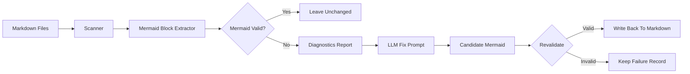

# mermaid-fixer-ts

A Node.js + TypeScript CLI that scans Markdown files, finds broken Mermaid code blocks, validates them with Mermaid itself, and uses an LLM to repair only the diagrams that fail validation.

This project is designed for documentation repos that already use Mermaid and want a safer, more automated way to clean up invalid diagrams without manually debugging every syntax error.

## What It Does

- Recursively scans a directory for Markdown files
- Extracts fenced ` ```mermaid ` blocks
- Validates each block with Mermaid
- Sends only invalid diagrams to the configured LLM
- Re-validates the AI output before accepting it
- Writes fixed Mermaid back into the original Markdown files
- Generates a JSON diagnostics report for every run

## Why Use It

Mermaid syntax errors are often small but frustrating:

- broken arrows such as malformed dotted or bold links
- invalid edge label formatting
- stray text after edges
- broken subgraph syntax
- pseudo-node syntax invented by an LLM
- labels containing code-like text, nested quotes, arrays, or JSON-like fragments

This tool gives you a validation-first workflow. A diagram is not accepted just because the model returned something Mermaid-like. It must pass Mermaid validation before it is written back.

## What Kind Of Mermaid It Fixes

The fixer is strongest on flowchart-style Mermaid and Mermaid generated by LLMs that is close to valid but still broken.

Examples of issues it can repair:

- malformed dotted arrows such as `-.-->` and `-.-->|label|`
- broken bold-arrow forms such as `== I` that should be `==>`
- edge labels placed in the wrong position
- dangling labeled edges with no valid target node
- quoted node references inside edges
- `subgraph` declarations with unsafe titles
- invalid `style` references that do not match real node IDs
- labels that contain heavy punctuation, escaped quotes, arrays, JSON-like values, or code fragments
- lines where an edge target and a new node declaration were accidentally merged together

Confidence note:

- It does not blindly rewrite every diagram
- It only attempts fixes on Mermaid that currently fails validation
- It validates the repaired output again before writing it

## How It Works



Processing flow:

1. Scan the target directory for Markdown files.
2. Extract Mermaid code blocks from each file.
3. Validate each block using Mermaid.
4. Send only invalid blocks to the configured LLM.
5. Sanitize and re-validate the returned Mermaid.
6. Write valid fixes back to the source files.
7. Save a JSON report describing what was found and what happened.

## Requirements

- Node.js 20+
- npm
- one LLM backend:
  - Ollama locally, or
  - an API key for OpenAI, Mistral, or DeepSeek, or
  - another OpenAI-compatible endpoint via custom base URL

## Installation

Install dependencies:

```bash
npm install
```

Build the CLI:

```bash
npm run build
```

Run from source:

```bash
node build/main.js --help
```

## Quick Start

Initialize a config file:

```bash
node build/main.js --init-config
```

Fix Mermaid in a docs folder:

```bash
node build/main.js -d ./docs
```

Run a safe detection-only pass:

```bash
node build/main.js -d ./docs --dry-run
```

Use plain console output instead of the Ink TUI:

```bash
node build/main.js -d ./docs --plain-ui
```

Show detailed per-block logs:

```bash
node build/main.js -d ./docs --verbose
```

## CLI Usage

Main usage:

```bash
node build/main.js -d <DIR> [OPTIONS]
```

If you package or install the binary as `mermaid-fixer`, the same commands become:

```bash
mermaid-fixer -d <DIR> [OPTIONS]
```

### Core Commands

Fix Mermaid in the current directory:

```bash
node build/main.js -d .
```

Fix Mermaid in a specific docs folder:

```bash
node build/main.js -d ./docs
```

Dry run only:

```bash
node build/main.js -d ./docs --dry-run
```

Use plain terminal output:

```bash
node build/main.js -d ./docs --plain-ui
```

Verbose mode:

```bash
node build/main.js -d ./docs --verbose
```

Use a custom config file:

```bash
node build/main.js -d ./docs --config ./config.toml
```

Write the default config and exit:

```bash
node build/main.js --init-config
```

Write the default config to a custom location:

```bash
node build/main.js --config ./my-config.toml --init-config
```

Override the report output path:

```bash
node build/main.js -d ./docs --report ./mermaid-fixer-report.json
```

Exclude files by regex:

```bash
node build/main.js -d ./docs --exclude "\\.tmp$" --exclude "^draft-"
```

Change output language:

```bash
node build/main.js -d ./docs --lang en
node build/main.js -d ./docs --lang zh
```

Show help:

```bash
node build/main.js --help
```

Show version:

```bash
node build/main.js --version
```

### LLM Override Commands

Use Ollama:

```bash
node build/main.js -d ./docs \
  --llm-provider ollama \
  --llm-model qwen3.5:9b
```

Use OpenAI:

```bash
node build/main.js -d ./docs \
  --llm-provider openai \
  --llm-model gpt-4o \
  --llm-api-key "$OPENAI_API_KEY"
```

Use a custom OpenAI-compatible base URL:

```bash
node build/main.js -d ./docs \
  --llm-provider openai \
  --llm-model my-model \
  --llm-base-url http://localhost:1234/v1 \
  --llm-api-key dummy
```

Override generation settings:

```bash
node build/main.js -d ./docs \
  --max-tokens 4096 \
  --temperature 0.1
```

## Config File

The CLI reads config from the OS config directory by default.

Default config paths:

- macOS: `~/Library/Application Support/mermaid-fixer-ts/config.toml`
- Linux: `~/.config/mermaid-fixer-ts/config.toml`
- Windows: `%APPDATA%\mermaid-fixer-ts\config.toml`

You can create the default config with:

```bash
node build/main.js --init-config
```

You can also point to a custom config file:

```bash
node build/main.js --config ./config.toml --init-config
node build/main.js -d ./docs --config ./config.toml
```

If the config file does not exist yet, the CLI creates a default one automatically on first load.

Example config:

```toml
# mermaid-fixer configuration
# Language for CLI output: "en" or "zh"
language = "en"

[llm]
# Provider: ollama, openai, mistral, deepseek, or any OpenAI-compatible endpoint
provider = "ollama"
model    = "qwen3.5:9b"
# api_key = "your-key"   # or set MERMAID_FIXER_LLM_API_KEY / LLM_API_KEY
# base_url = ""          # defaults are applied per provider
max_tokens  = 4096
temperature = 0.1

[mermaid]
timeout_seconds = 120
max_retries     = 3

[scan]
# Regex patterns for file names to skip.
# "._*" is skipped automatically.
exclude_patterns = []

[report]
# Optional explicit report path.
# Leave empty to use the default OS app-state reports directory.
path = ""
```

Environment variable support:

<<<<<<< dev
- `MERMAID_FIXER_LLM_API_KEY`
=======
- `LITHO_LLM_API_KEY`
>>>>>>> main
- `LLM_API_KEY`

These are used if `api_key` is not already set in config or via CLI flag.

CLI flags override config values for that run.

## Reports

Each run writes a JSON diagnostics report.

Default report locations:

- macOS: `~/Library/Application Support/mermaid-fixer-ts/reports/`
- Linux: `~/.local/state/mermaid-fixer-ts/reports/`
- Windows: `%LOCALAPPDATA%\mermaid-fixer-ts\reports\`

By default the filename is timestamped.

You can override the report path:

```bash
node build/main.js -d ./docs --report ./mermaid-fixer-report.json
```

### What The Report Contains

The report includes:

- scan timestamp
- root directory
- summary counts
- every broken Mermaid block found
- file path, line, and column
- diagram type
- original broken Mermaid
- whether the block stayed `broken`, became `fixed`, or `failed`
- validator error details
- AI raw response
- extracted AI Mermaid candidate
- final fixed Mermaid when a fix succeeds

Status meanings:

- `broken`: found during scan, before AI fixing
- `fixed`: AI returned Mermaid that passed validation and was accepted
- `failed`: AI was attempted, but the candidate still failed validation or could not be used

Important behavior:

- reports are written in both normal mode and `--dry-run`
- reports are stored outside your docs directory by default
- reports help you inspect failures without modifying content

## UI Modes

The CLI supports two output modes:

- Ink TUI by default when running in a TTY
- plain console output with `--plain-ui`

The packaged SEA binary currently runs plain console mode instead of the full-screen TUI.

## npm Scripts

Useful local commands:

```bash
npm install
npm run build
npm run check
npm run dev
npm run start -- -d ./docs
npm run package:sea
npm run bundle:sea
```

What they do:

- `npm run build`: compile TypeScript into `build/`
- `npm run check`: type-check without emitting files
- `npm run dev`: build first, then run the CLI
- `npm run start -- -d ./docs`: run the compiled CLI directly
- `npm run bundle:sea`: create the SEA bundle entry file
- `npm run package:sea`: build a standalone Node SEA executable in `dist/`

## Standalone Release Packaging

This project packages standalone executables using Node SEA.

Local package command:

```bash
npm run package:sea
```

Generated file names depend on the current platform:

- macOS ARM64: `dist/mermaid-fixer-mac-arm64`
- macOS x64: `dist/mermaid-fixer-mac-x64`
- Linux x64: `dist/mermaid-fixer-linux-x64`
- Windows x64: `dist/mermaid-fixer-windows-x64.exe`

Run a packaged binary locally:

```bash
./dist/mermaid-fixer-mac-arm64 --help
```

Override the base Node runtime used for SEA packaging:

```bash
SEA_BASE_BINARY=/path/to/node npm run package:sea
```

For GitHub releases, the workflow builds on platform-specific runners and uploads the generated binaries as release assets.

## Example Workflow

1. Build the project:

```bash
npm run build
```

2. Initialize config:

```bash
node build/main.js --init-config
```

3. Edit your config or pass CLI overrides for your model.

4. Test with a dry run:

```bash
node build/main.js -d ./docs --dry-run --verbose
```

5. Run the actual fix:

```bash
node build/main.js -d ./docs
```

6. Inspect the JSON report for fixed and failed blocks.

## Credits

This project is inspired by [sopaco/mermaid-fixer](https://github.com/sopaco/mermaid-fixer), which introduced the original idea of automatically detecting and repairing invalid Mermaid in Markdown files.

This repository is a Node.js and TypeScript implementation that keeps that workflow direction while using a Node-native Mermaid validation and packaging stack.

## Project Status

This project is still in an early stage.

Testing is ongoing continuously, and the fixer behavior is still being hardened against more Mermaid edge cases and more model-specific output quirks. It is already useful for real documentation cleanup, especially for flowchart-heavy Mermaid and LLM-generated Mermaid that is close to valid, but you should still review fixes and keep the JSON report as part of your workflow.

## License

MIT
