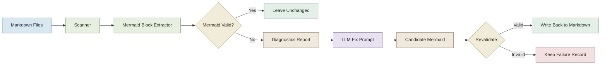

# mermaid-fixer-ts

A Node.js TypeScript CLI for detecting and repairing broken Mermaid blocks inside Markdown with local or remote LLMs.

## Why The Change Was Required

The earlier Deno-based version had the right pipeline but the wrong foundation for Mermaid validation and packaging.

- Mermaid’s runtime ecosystem is Node-first, not Deno-first.
- The old validator path produced runtime issues such as `DOMPurify.addHook is not a function`, which created false syntax failures.
- Local-model integration and packaging are easier to maintain in Node.
- The CLI now has a proper Ink-based TUI, which is much easier to build and evolve in the Node ecosystem.

Short version: the workflow was worth keeping, but the runtime had to move.

## How It Works

The fixer only asks the model to touch diagrams that actually fail validation.



## Current Stack

- Node.js 20+
- TypeScript
- Mermaid
- Ink
- Chalk
- `smol-toml`

## Getting Started

### Prerequisites

- Node.js 20+
- npm
- an LLM provider:
  - Ollama locally, or
  - an API key for OpenAI / Mistral / DeepSeek

### Install

```bash
npm install
```

### Build

```bash
npm run build
```

### Run

```bash
node build/main.js -d ./docs
```

### Plain Console Fallback

```bash
node build/main.js -d ./docs --plain-ui
```

## Configuration

Config is supported now.

By default the CLI looks in the OS config directory, not the current working directory.

- macOS: `~/Library/Application Support/mermaid-fixer-ts/config.toml`
- Linux: `~/.config/mermaid-fixer-ts/config.toml`
- Windows: `%APPDATA%\mermaid-fixer-ts\config.toml`

You can create it explicitly with:

```bash
node build/main.js --init-config
```

If the file does not exist yet, the CLI will also create a default one on first run.

For bundled binaries, the same rule applies. The config is external and user-editable; it is not embedded into the executable.

You can override the location with `--config /path/to/config.toml`.

```toml
language = "en"

[llm]
provider    = "ollama"
model       = "llama3"
# api_key   = "your-key"
max_tokens  = 4096
temperature = 0.1

[mermaid]
timeout_seconds = 120
max_retries     = 3

[scan]
exclude_patterns = []

[report]
# Optional explicit report path.
# If empty, reports are written to the OS app-state directory:
# macOS:  ~/Library/Application Support/mermaid-fixer-ts/reports/
# Linux:  ~/.local/state/mermaid-fixer-ts/reports/
# Win:    %LOCALAPPDATA%\\mermaid-fixer-ts\\reports\\
path = ""
```

## Report Storage

Reports no longer default to the scanned directory.

That was noisy and unsafe for content repos because every run dropped a JSON artifact into user content space. The new default is:

- macOS: `~/Library/Application Support/mermaid-fixer-ts/reports/`
- Linux: `~/.local/state/mermaid-fixer-ts/reports/`
- Windows: `%LOCALAPPDATA%\mermaid-fixer-ts\reports\`

Each default report uses a timestamped filename.

You can still override it explicitly with `--report /path/to/report.json`.

## CLI Reference

```text
USAGE:
  mermaid-fixer -d <DIR> [OPTIONS]

OPTIONS:
  -d, --directory  <DIR>      Directory to scan (required)
  -c, --config     <FILE>     Config file path  [default: OS config directory]
      --init-config           Write the default config file and exit
      --dry-run               Detect issues only — do not modify files
      --plain-ui              Disable Ink full-screen UI
  -v, --verbose               Show per-file / per-block detail
      --lang       <LANG>     Output language: en (default) or zh
      --report     <FILE>     JSON diagnostics report path
                             [default: OS app-state reports directory]

  LLM options:
      --llm-provider  <NAME>  Provider: ollama, openai, mistral, deepseek
      --llm-model     <NAME>  Model name
      --llm-api-key   <KEY>   API key
      --llm-base-url  <URL>   Custom API base URL
      --max-tokens    <N>     Max tokens
      --temperature   <F>     Temperature 0.0–1.0

  File filtering:
      --exclude  <PATTERN>    Regex to skip files by name
```

## Release Builds

Tagged releases now use a Node-native packaging flow instead of the old Deno compile path.

The release workflow:

1. installs dependencies
2. builds TypeScript
3. bundles the CLI with `esbuild`
4. creates a Node SEA blob
5. injects that blob into a native Node runtime on each OS runner
6. uploads the resulting executable to the GitHub Release

This lives in `.github/workflows/release.yml`.

Current release assets are native executables, not `.dmg` installers.

- macOS: standalone binary
- Linux: standalone binary
- Windows: `.exe`

If you want a `.dmg` later, that is a separate packaging step on top of the macOS binary.

## Local Release Testing

You do not need to push a tag to test the release build.

Native local package test:

```bash
npm run package:sea
./dist/mermaid-fixer-mac-arm64 --help
```

The packaged SEA binary currently runs the plain console mode, not the Ink full-screen TUI. This keeps the standalone build stable and dependency-free.

If you want to override the runtime used as the SEA base binary, set:

```bash
SEA_BASE_BINARY=/path/to/node npm run package:sea
```

That matters on macOS because a Homebrew Node install is usually not a good standalone SEA base. For a real native release build, use the official Node runtime from `actions/setup-node` in GitHub Actions or another SEA-capable Node distribution.

Linux-style release test with Docker:

```bash
docker run --rm \
  -v "$PWD":/workspace \
  -w /workspace \
  node:20-bookworm \
  bash -lc "npm ci && npm run package:sea && ./dist/mermaid-fixer-linux-x64 --help"
```

## TUI Screenshots

Add screenshots only after sanitizing terminal content.

The sample screenshot in current discussion should not go into the README unchanged because it includes:

- your macOS username in the absolute path
- your local working directory structure
- a temporary rendering artifact in the header

Use a sanitized run like:

- `/workspace/demo-docs`
- generic model names if needed
- no personal home directory paths

Recommended screenshot set:

1. startup / scan phase
2. active fix phase with green/red progress
3. quit confirmation modal

## Inspiration & Credits

This project is a TypeScript rewrite inspired by **[sopaco/mermaid-fixer](https://github.com/sopaco/mermaid-fixer)**.

The original concept and overall pipeline direction came from that work.

## License

MIT
